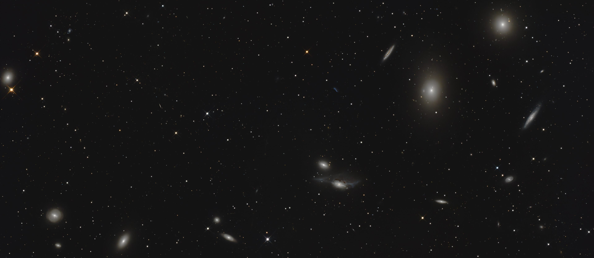

# A guide to the stars

Hi, I’m Michael and I enjoy astrophotography for quite some time now. This is a compendium of the knowledge I gathered during that time so it may help you on your own journey.

This is by no means a complete guide as I haven't tried every aspect of astrophotography nor will I claim that it is  always 100% correct. Please use it as a starting point and check other sources - as you always should. It also covers deep sky astrophotography only.

This guide will cover what I learned about gear acquisition, operating said great, stacking and post processing.

I will continue to expand this guide if time permits. 
